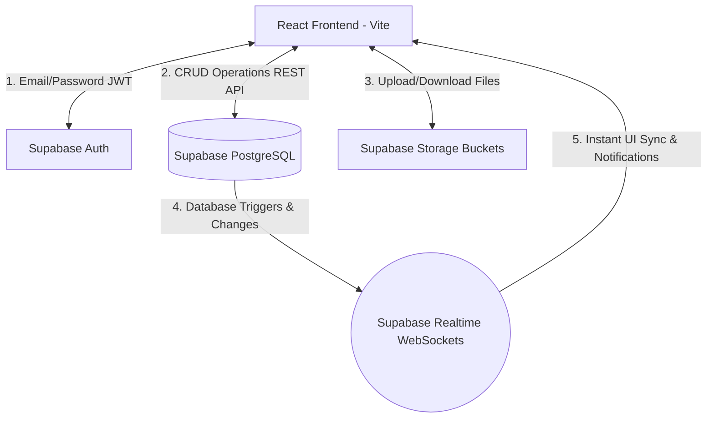
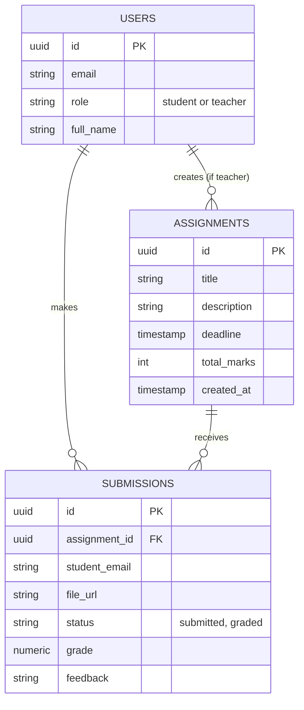
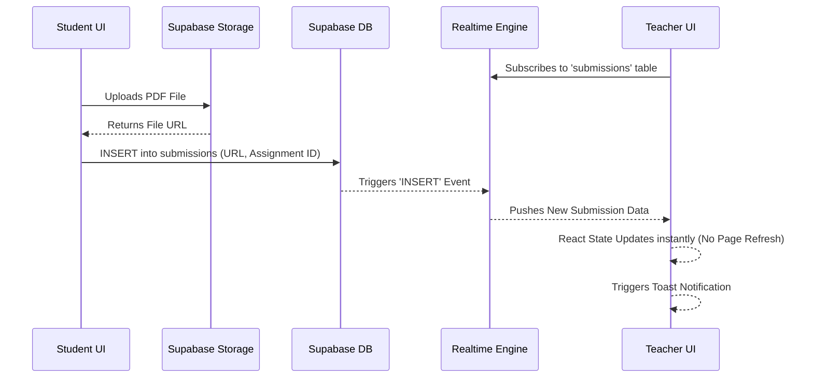

# Report 1: Project Analysis and Implementation Detail
## Project: Cloud-Based Student Assignment Submission System (SyncLink)

**Course:** Cloud Computing  
**Program:** BS Software Engineering – 8th Semester  

---

### 1. Project Introduction
The "SyncLink: Cloud-Based Student Assignment Submission System" is a modern, enterprise-grade web application designed to digitize and optimize the academic assignment workflow. By utilizing cloud-based infrastructure (Backend-as-a-Service), it provides a centralized platform for assignment distribution, submission, evaluation, and real-time feedback, ensuring that academic records are securely stored, instantly synchronized, and easily accessible.

### 2. Problem Statement
Traditional and manual assignment management leads to several bottlenecks:
- **Disorganization:** Handling physical files or disparate email threads is tedious for instructors.
- **Feedback & Sync Delay:** Students often wait a long time to receive marks. Furthermore, manual page refreshes are required to see new tasks or updates.
- **Data Integrity:** Local storage risk of hardware failure can result in loss of student work.
- **Tracking & Analytics:** Difficult to monitor deadlines, calculate class averages, and track pending reviews across large classes without visual aids.

### 3. Objectives
The primary objectives successfully achieved in this project are:
- **Centralized Platform:** A dedicated portal for Teachers to post tasks and Students to submit work.
- **Cloud Integration:** Utilizing Supabase for Authentication, PostgreSQL Database, and Storage.
- **Real-Time Synergy:** Implementing WebSockets (Supabase Realtime) for instant notifications and data syncing without manual page refreshes.
- **Automated Evaluation:** A built-in system for grading and providing feedback.
- **Advanced Analytics:** Providing instructors with live, data-driven insights (Donut charts, progress bars) into class performance.

### 4. Scope of the System
The system has been fully implemented with the following premium features:

**Student Features:**
- **Task View:** View all published assignments with deadlines.
- **Secure Submission:** Drag-and-drop uploader with strict PDF/Word validation and cloud bucket storage.
- **Real-Time Alerts:** Instant toast notifications and dashboard updates when a teacher posts a new task or grades a submission.
- **Evaluation History:** View marks and teacher feedback for every submission.
- **Dynamic Analytics:** Visual representation of personal progress and pending tasks.

**Teacher Features:**
- **Assignment Management:** Create tasks with specific titles, descriptions, marks, and Date/Time deadlines.
- **Live Class Overview:** A dynamic analytics dashboard featuring a real-time Donut Chart for "Submission Status" (Graded vs Pending) and a class average mastery progress bar.
- **Grading Suite:** Integrated interface to download files, assign marks, and give feedback.
- **Live Feed (WebSockets):** Instant notification and auto-refresh of the Review Queue when any student submits a file.

### 5. Requirement Analysis

#### **Functional Requirements:**
1. **Authentication & Authorization:** Secure, role-based access for Students and Teachers with cached session handling for instant initial load times.
2. **Database Management:** Relational SQL schema linking `assignments` to `submissions` with cascading deletes and foreign keys.
3. **Storage Management:** Secure cloud storage (Supabase Buckets) for documents with dynamic file URL generation.
4. **Real-Time Pub/Sub:** WebSocket subscriptions to PostgreSQL tables (`INSERT`, `UPDATE`, `DELETE` events) for instant UI updates.
5. **Data Visualization:** Analytical charts (Pie/Donut and Bar charts) dynamically rendering database statistics (Unique students, Total tasks, Graded ratio).

#### **Non-Functional Requirements:**
1. **Premium UI/UX:** High-end SaaS aesthetic using "Teal and Blue" dark gradients, frosted glassmorphism (glass-cards), and modern typography (Plus Jakarta Sans).
2. **Performance (Optimistic Updates):** The system uses optimistic UI updates (e.g., instant logout feedback, local array mapping) to eliminate loading spinners and reduce database queries.
3. **Reliability & Scalability:** 99.9% uptime guaranteed by Supabase cloud infrastructure, capable of handling concurrent student submissions.
4. **Responsiveness:** Fluid and fully functional on both mobile and desktop screens using Tailwind CSS.
5. **Dark Mode Support:** Seamless transition between Light and Dark themes without visual breakages.

### 6. System Architecture & Tech Stack
The system follows a **Serverless Cloud Architecture (BaaS)**:

1. **Frontend (Client):** 
   - **React.js (Vite):** Core framework for fast rendering.
   - **Tailwind CSS:** For premium styling, gradients, and responsiveness.
   - **Framer Motion:** For micro-interactions and smooth page transitions.
   - **Recharts:** For rendering data-driven analytical charts.
2. **Cloud Backend (Supabase):**
   - **Authentication:** Manages user sessions, JWT tokens, and role-based routing.
   - **PostgreSQL Database:** Stores structured data with Row Level Security (RLS) policies.
   - **Real-Time Engine:** Broadcasts database changes to connected clients instantly.
   - **Cloud Storage:** High-performance storage buckets for binary files.

---

### 7. Proposed Diagrams for University Report
*Note for the user: You should include the following 3 diagrams in your final project documentation. Below are the rough structures (Mermaid JS format) which you can copy-paste into [Mermaid Live Editor](https://mermaid.live/) to generate the images.*

#### A. System Architecture Diagram
**Purpose:** Shows how the React frontend communicates with the Supabase Cloud Backend.

#### B. Entity Relationship Diagram (ERD)
**Purpose:** Shows the relationship between your primary database tables.

#### C. Sequence Diagram (Realtime Submission Flow)
**Purpose:** Shows the step-by-step process of a student submitting work and the teacher receiving a live update.

### 8. Conclusion & Implementation Status
The project has successfully moved past the initial design phase into a fully functional, production-ready implementation. All core modules—including the advanced grading system, real-time notification engine, and premium data-visualization dashboard—are now live. The recent UI overhaul to a premium Teal/Blue aesthetic further elevates the system to enterprise SaaS standards.
